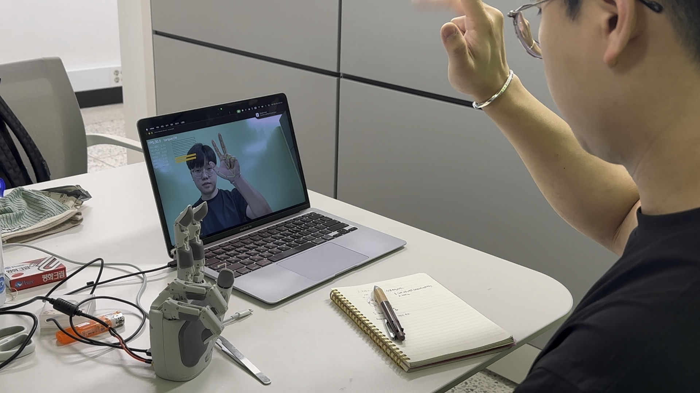
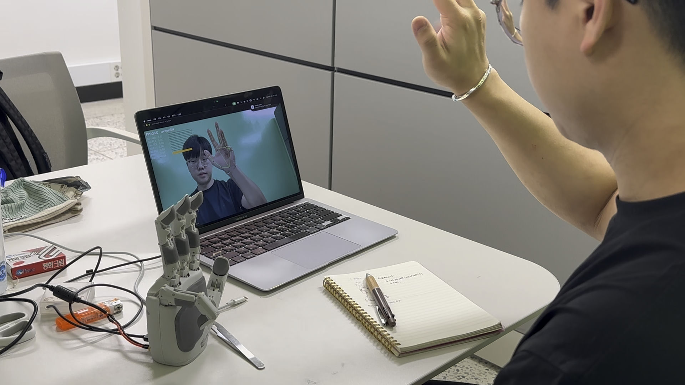

# Aero Hand Open — MediaPipe 텔레오퍼레이션

TetherIA의 오픈소스 힘줄 구동 로봇손 [Aero Hand Open](https://github.com/TetherIA/aero_hand_open)을, 노트북 카메라 하나로 실시간 조작하는 텔레오퍼레이션 파이프라인입니다.

## 왜 만들었나

ETRI 겨울 연구연수생 시절 매니퓰레이터(Franka Panda)를 대상으로 텔레오퍼레이션 데이터 수집 파이프라인을 구축했습니다. 인턴이 끝난 뒤에도 "사람의 시연을 로봇이 이해할 수 있는 신호로 어떻게 바꿀 것인가"라는 문제의식을 놓지 않고, 완전히 다른 자유도의 하드웨어(다지형 로봇손)에 같은 원리를 스스로 옮겨본 개인 프로젝트입니다.

## 데모

 

카메라로 손 모양을 인식하는 동시에, 실제 Aero Hand가 그 모양을 그대로 따라 움직입니다.

## 단계별 구성

작은 단위로 끊어서 하나씩 검증하며 올라간 구조입니다.

| 파일 | 단계 | 내용 |
|---|---|---|
| `mp_test.py` | Step 1 | MediaPipe Hand Landmarker로 카메라에서 손 키포인트 21개가 잘 잡히는지 확인 (로봇 미연결) |
| `mp_bend.py` | Step 2 | 손가락 4개(검지·중지·약지·소지)의 굽힘 비율(0~1)을 계산 |
| `hand_mirror.py` | Step 3 (메인) | 카메라 손 동작 → 로봇손 7채널 액추에이션으로 변환해 실시간 전송 |
| `poses.py` | — | 가위바위보 등 사전 정의 포즈, 정규화값(0~1)을 실제 서보 actuation 범위로 변환하는 유틸 |
| `reverse_torque.py` | — | 서보 역방향 토크 제어 유틸 |
| `test_poses.py` | — | 포즈 순환 테스트 스크립트 |

## 굽힘 비율 계산

MCP→PIP, PIP→TIP 두 벡터 사이 각도의 코사인으로 굽힘 정도를 구합니다.

```
cos = 1  (같은 방향, 완전히 펴짐)   → bend = 0
cos = -1 (반대 방향, 완전히 굽힘)   → bend = 1
bend = (1 - cos) / 2
```

엄지는 나머지 손가락과 관절 구조가 달라 별도 처리했습니다. 굽힘(flexion)은 같은 방식으로 계산하되, 벌림(abduction)은 엄지 끝(TIP)과 새끼 손가락 뿌리(MCP) 사이 거리를 손 크기로 정규화해 매핑했습니다.

## 실시간 미러링에서 신경 쓴 부분

카메라 입력을 그대로 로봇에 흘려보내면 손 떨림이 그대로 로봇 관절에 전달되고, 급격한 신호는 실제 힘줄(텐던) 기반 하드웨어를 손상시킬 수 있습니다.

- **EMA 필터**: 프레임 간 노이즈를 지수이동평균으로 완화
- **Slew limit**: 프레임 간 변화율을 제한해 텐던 보호
- **Clamp 0~1**: 정규화 범위를 벗어나지 않도록 방지
- **SPACE 키 토크 해제**: 문제 상황에서 즉시 모든 서보 토크를 끊는 긴급 정지

## 실행

```bash
pip install -r requirements.txt

python mp_test.py      # Step 1: 카메라 + 손 검출 확인 (로봇 불필요)
python mp_bend.py      # Step 2: 굽힘 비율 계산 확인 (로봇 불필요)
python hand_mirror.py  # Step 3: 실제 로봇손 실시간 미러링 (로봇 연결 필요)
```

`q`로 종료, `SPACE`로 토크 on/off 토글.

## 하드웨어 / 의존성

- [TetherIA Aero Hand Open](https://github.com/TetherIA/aero_hand_open) — 오픈소스 힘줄 구동 로봇손 (`aero_open_sdk` 별도 설치 필요, 이 리포에는 미포함)
- MediaPipe Hand Landmarker 모델(`hand_landmarker.task`) — [공식 배포처](https://ai.google.dev/edge/mediapipe/solutions/vision/hand_landmarker)에서 별도 다운로드 필요
- Python 3.12+

## 다음 계획

BC(Behavioral Cloning) 학습용 데이터 수집 기능을 추가해, 이 텔레오퍼레이션 파이프라인으로 실제 시연 데이터를 모으고 모방학습 정책을 학습시켜볼 예정입니다.
